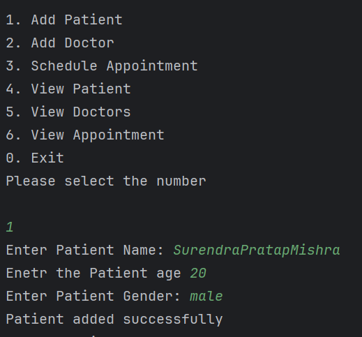
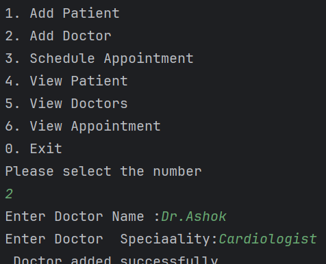

# 🏥 Hospital Management System

A simple console-based Hospital Management System developed in Java. This project allows you to manage **patients**, **doctors**, and **appointments** using basic object-oriented principles and Java collections.

---

## 📌 Features

- Add and manage **Patients**

- 
  
- Add and manage **Doctors** with specializations
  
  
- Schedule **Appointments** between patients and doctors
- ;
- 
- View lists of Patients, Doctors, and Appointments
- Unique ID generation for each Patient and Doctor

---

## 💻 Technologies Used

- **Java** (OOP, ArrayList, Scanner)
- **Console-based UI**
- No external libraries or databases used

---

## 📂 Project Structure

Hospital_Management/
├── HospitalManagement.java
└── README.md

## Sample Menu Options

1. Add Patient
2. Add Doctor
3. Schedule Appointment
4. View Patient
5. View Doctors
6. View Appointment
0. Exit
